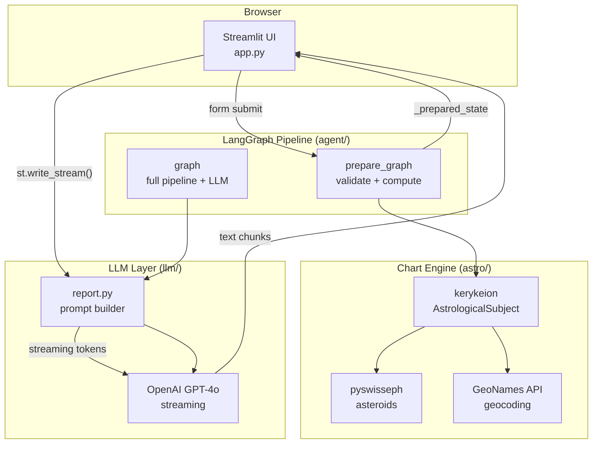
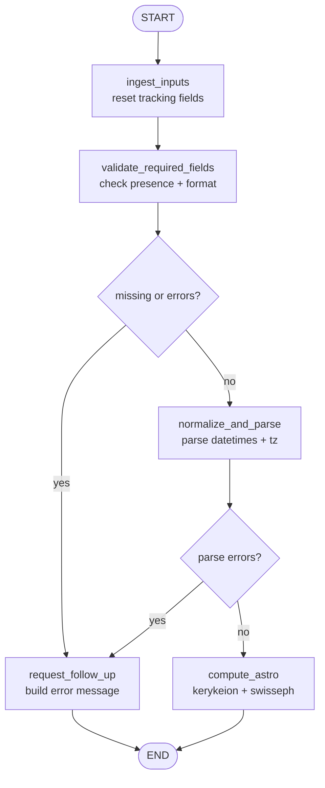
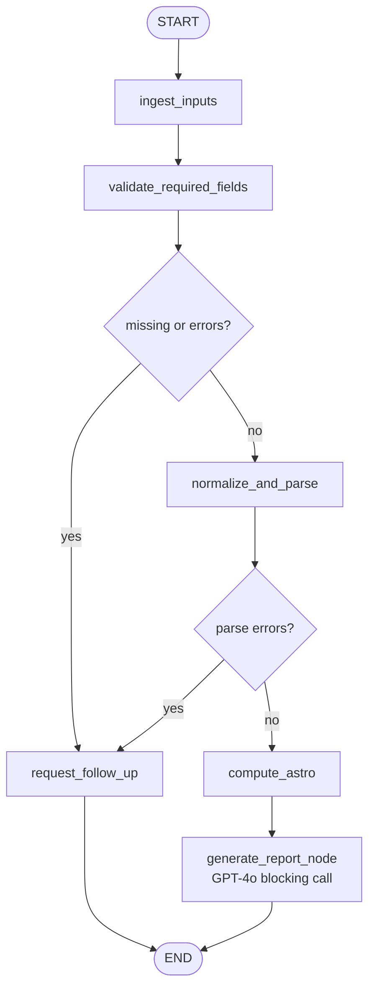
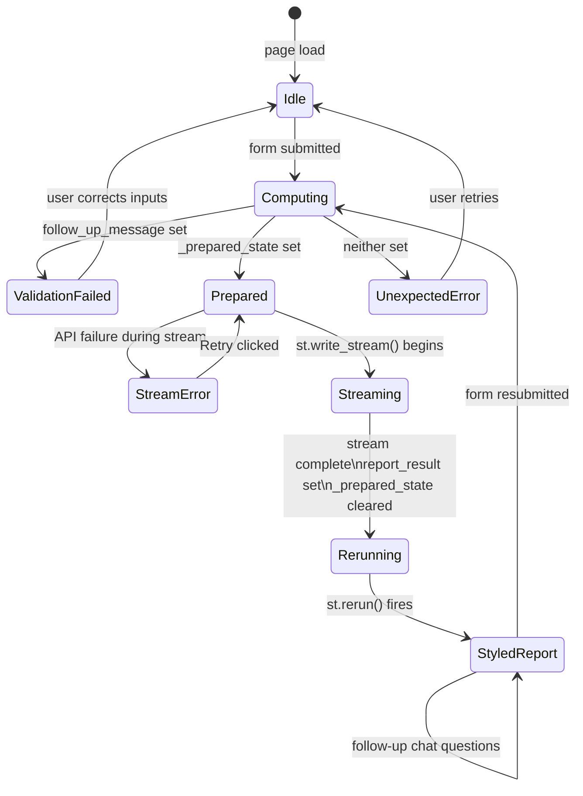
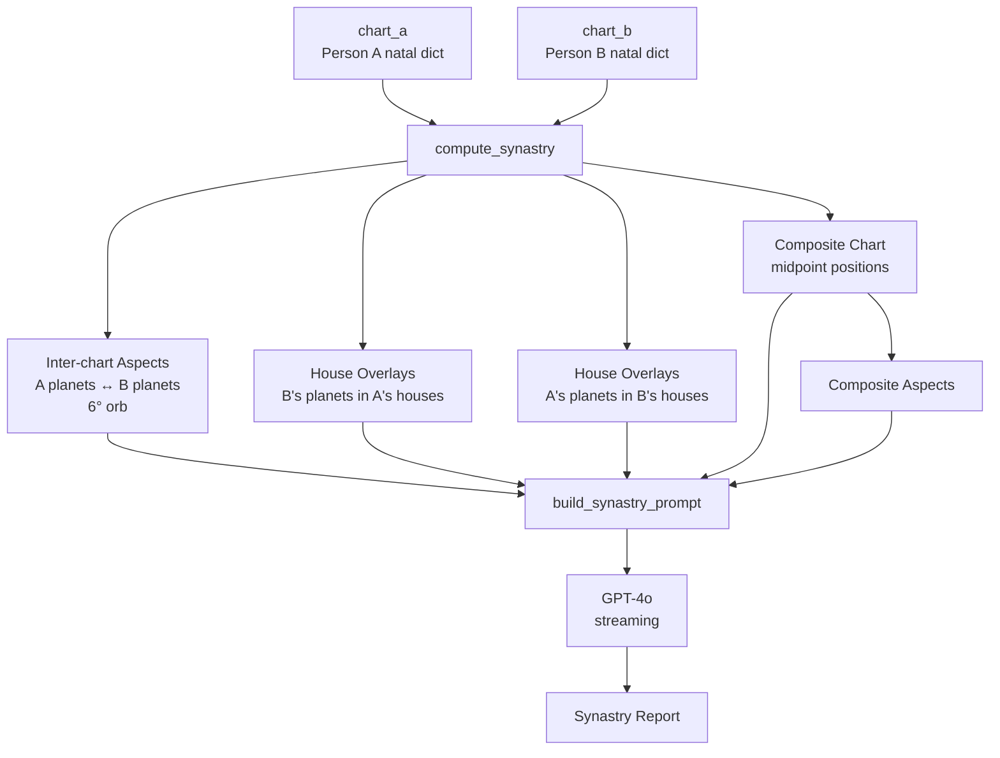
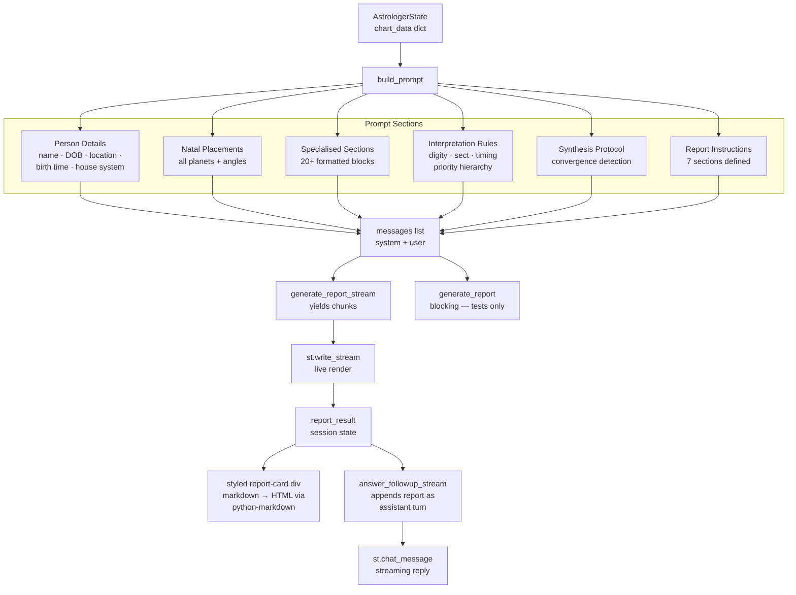
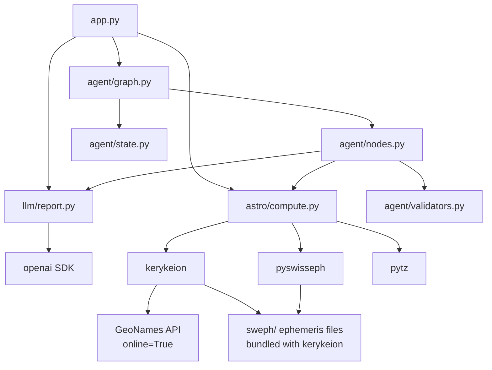
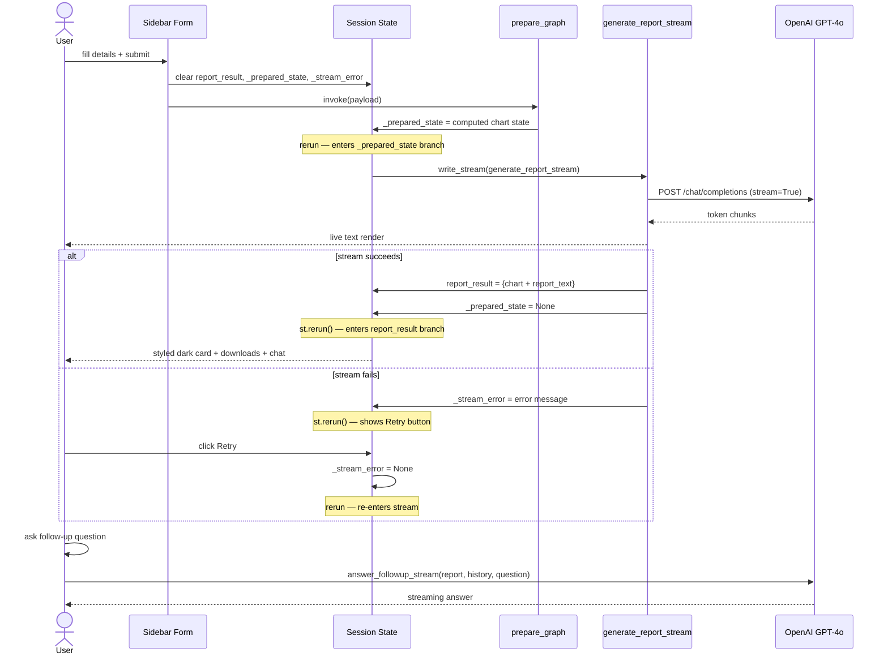

# Architecture

## System Overview

---

## LangGraph Graphs

### `prepare_graph` — Used by `app.py` on form submission

### `graph` — Full pipeline (integration tests)

---

## Streamlit Rendering State Machine

---

## Natal Chart Computation Pipeline

```mermaid
flowchart TD
    S([compute_chart called]) --> SUBJ[AstrologicalSubject\nkerykeion + GeoNames]
    SUBJ --> P[Planets\nSun–Pluto + Chiron]
    SUBJ --> H[House Cusps\nall 12, with rulers]
    SUBJ --> AN[Angles\nASC + MC]
    SUBJ --> NN[Lunar Nodes\nNorth + South]

    P --> DIG[Essential Dignities\ndomicile / exaltation /\ndetriment / fall]
    P --> BAL[Elemental & Modal\nBalance]
    P --> SECT[Planetary Sect\nday / night chart]
    P --> LP[Lunar Phase\nnatal Moon archetype]

    H --> HR[House Rulers\nnatal condition of each ruler]

    AN --> CR[Chart Ruler\nASC sign → ruling planet]

    P & H & AN --> ASP[Natal Aspects\nconjunction / sextile /\nsquare / trine / opposition]
    ASP --> PAT[Aspect Patterns\nGrand Trine / T-Square /\nYod / Grand Cross / Kite]

    P & AN --> FS[Fixed Stars\n1° orb conjunctions]
    P & AN --> ANA[Anaretic Degrees\n29° planets]
    P --> ANT[Antiscia\nsolstice-point connections]
    P --> MR[Mutual Receptions]
    P --> STELL[Stelliums\n3+ planets same sign/house]

    P --> POF[Part of Fortune\n& Arabic Parts]

    SW[pyswisseph] --> AST[Major Asteroids\nCeres · Pallas · Juno · Vesta]

    subgraph Predictive
        TR[Current Transits\n3° orb]
        UT[Upcoming Transits\nnext 90 days]
        PROG[Secondary Progressions\nprogressed date positions]
        PA[Progressed Aspects\nto natal chart]
        SA[Solar Arc Directions\narc positions + aspects]
        SR[Solar Return\nannual return chart]
        PRO[Annual Profection\nhouse + lord of the year]
        FIR[Firdaria\nmajor + sub time lords]
    end

    P & AN --> TR
    P & AN --> UT
    P --> PROG --> PA
    P & AN --> SA
    P --> SR
    H & P --> PRO
    P --> FIR

    subgraph Vedic
        SID[Sidereal Positions\nLahiri ayanamsa]
        NAK[Moon Nakshatra\n+ pada]
        DASH[Vimshottari Dasha\nmahadasha + antardasha]
        YOGA[Vedic Yogas\nPancha Mahapurusha +\nGajakesari + Raj etc.]
    end

    P --> SID --> NAK
    SID --> DASH
    SID --> YOGA

    subgraph SVG
        CSVG[Natal Chart SVG\nKerykeionChartSVG]
        TSVG[Transit Overlay SVG]
    end

    SUBJ --> CSVG
    SUBJ --> TSVG
```

---

## Synastry Computation Pipeline

---

## LLM Prompt Architecture

---

## Module Dependencies

---

## Session State Lifecycle

