# Architecture

## Color Key

| Color | Meaning |
|---|---|
| 🔵 Blue | User input / UI |
| 🟣 Purple | Computation / processing |
| 🟠 Amber | LLM / AI |
| 🟢 Green | Output / result |
| 🔴 Red | Error path |
| ⬛ Dark | State / data store |

---

## System Overview

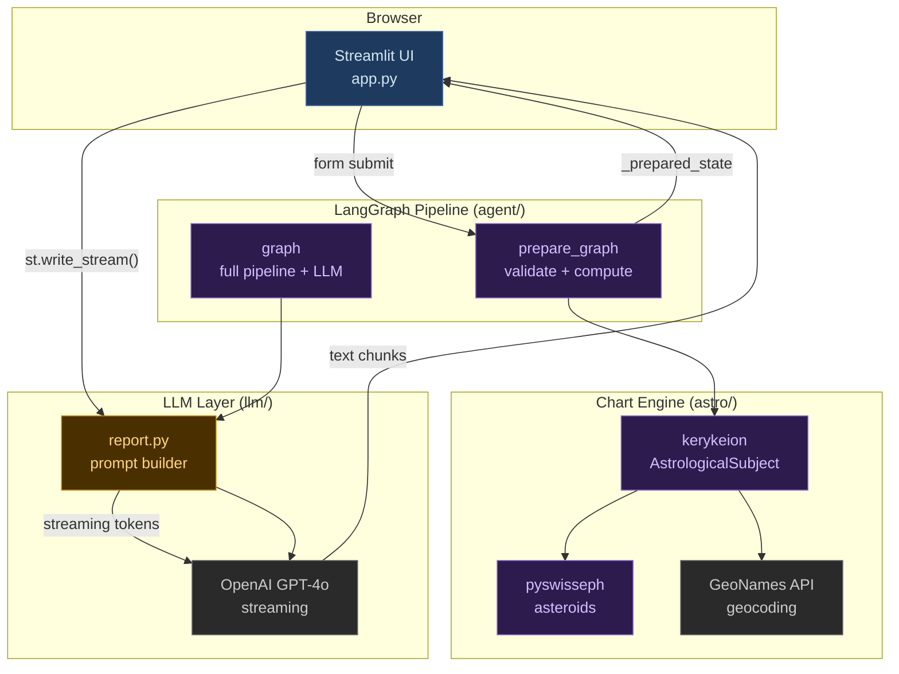

---

## LangGraph Graphs

### `prepare_graph` — used by `app.py` on form submission

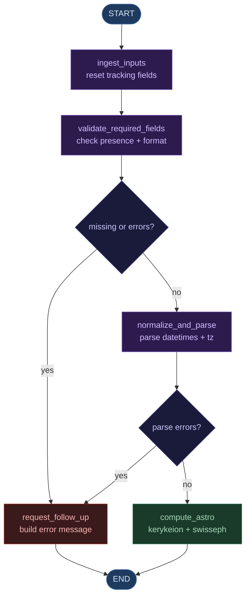

### `graph` — full pipeline (integration tests only)

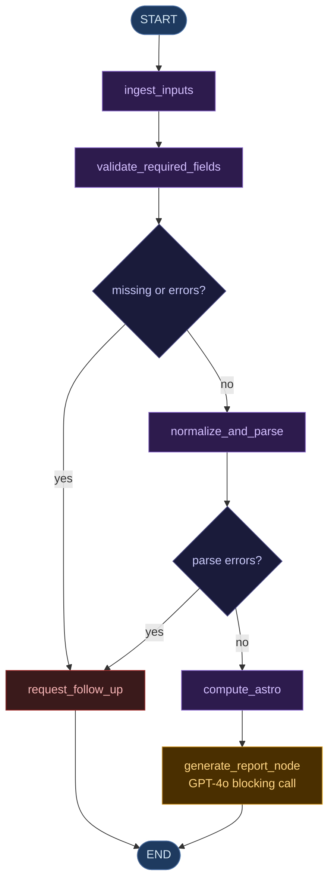

---

## `AstrologerState` Data Flow

Each node in the LangGraph pipeline reads and writes specific keys of `AstrologerState`. This diagram shows the full lifecycle of every state field.

```mermaid
flowchart TD
    classDef inputKey fill:#1e3a5f,stroke:#4a6fa5,color:#d4e6f1,font-size:11px
    classDef validKey fill:#3a1a1a,stroke:#a52a2a,color:#f8b4b4,font-size:11px
    classDef parsedKey fill:#2d1b4e,stroke:#8866cc,color:#d4bfff,font-size:11px
    classDef chartKey fill:#1a3a2a,stroke:#2d7a4f,color:#a8d8b8,font-size:11px
    classDef outputKey fill:#4a3000,stroke:#c8860a,color:#ffd580,font-size:11px
    classDef nodeBox fill:#111,stroke:#555,color:#eee,font-size:12px

    subgraph Raw["Raw Inputs — set by app.py"]
        I1[full_name]:::inputKey
        I2[dob]:::inputKey
        I3[birth_location]:::inputKey
        I4[birth_time]:::inputKey
        I5[birth_time_timezone]:::inputKey
        I6[birth_time_confidence]:::inputKey
        I7[house_system]:::inputKey
        I8[current_location]:::inputKey
        I9[current_datetime]:::inputKey
        I10[report_focus]:::inputKey
        I11[additional_info]:::inputKey
    end

    subgraph N1["ingest_inputs"]
        N1B[ ]:::nodeBox
    end

    subgraph Tracking["Validation Tracking — reset by ingest_inputs"]
        V1[missing_fields = \[\]]:::validKey
        V2[validation_errors = \{\}]:::validKey
        V3[parsed_dob = None]:::parsedKey
        V4[parsed_birth_datetime = None]:::parsedKey
        V5[parsed_current_datetime = None]:::parsedKey
        V6[chart_data = None]:::chartKey
        V7[follow_up_message = None]:::outputKey
        V8[final_report = None]:::outputKey
    end

    Raw --> N1
    N1 --> Tracking

    subgraph N2["validate_required_fields"]
        N2B[ ]:::nodeBox
    end

    Tracking --> N2

    subgraph V["Written by validate_required_fields"]
        V9[missing_fields]:::validKey
        V10[validation_errors]:::validKey
    end

    N2 --> V

    subgraph N3["normalize_and_parse"]
        N3B[ ]:::nodeBox
    end

    V --> N3

    subgraph P["Written by normalize_and_parse"]
        P1[parsed_dob]:::parsedKey
        P2[parsed_birth_datetime]:::parsedKey
        P3[parsed_current_datetime]:::parsedKey
    end

    N3 --> P

    subgraph N4["compute_astro"]
        N4B[ ]:::nodeBox
    end

    P --> N4

    subgraph C["Written by compute_astro"]
        C1[chart_data\nfull astrological dict]:::chartKey
    end

    N4 --> C

    subgraph N5["generate_report_node"]
        N5B[ ]:::nodeBox
    end

    C --> N5

    subgraph O["Written by generate_report_node"]
        O1[final_report]:::outputKey
    end

    N5 --> O
```

**Key reads by node:**

| Node | Reads | Writes |
|---|---|---|
| `ingest_inputs` | all raw inputs from state | resets: `missing_fields=[]`, `validation_errors={}`, `parsed_*=None`, `chart_data=None`, `follow_up_message=None`, `final_report=None` |
| `validate_required_fields` | all raw inputs | `missing_fields`, `validation_errors` |
| `request_follow_up` | `missing_fields`, `validation_errors` | `follow_up_message`, `final_report=None` |
| `normalize_and_parse` | `dob`, `birth_time`, `birth_time_timezone`, `current_datetime` | `parsed_dob`, `parsed_birth_datetime`, `parsed_current_datetime` |
| `compute_astro` | `parsed_birth_datetime`, `parsed_current_datetime`, `birth_location`, `current_location`, `birth_time_timezone`, `house_system`, `full_name` | `chart_data` |
| `generate_report_node` | entire state (passed to `build_prompt`) | `final_report` |

---

## Streamlit Rendering State Machine

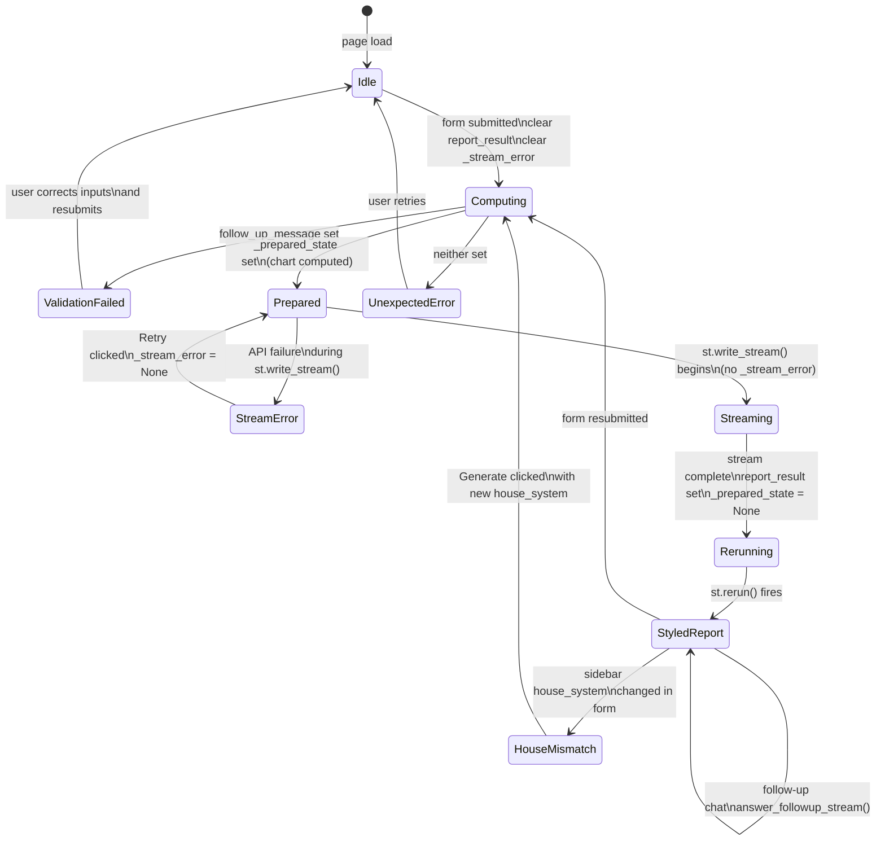

---

## Natal Chart Computation — Part 1: Static Analysis

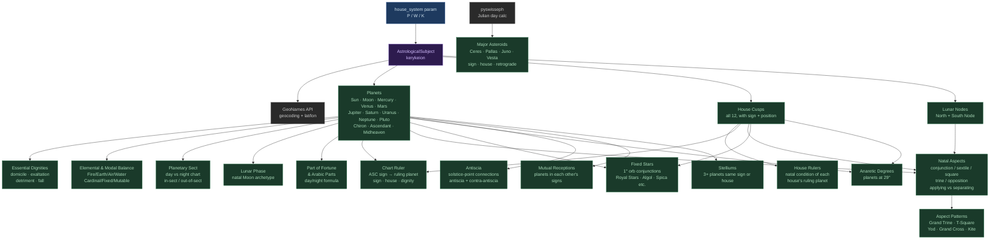

---

## Natal Chart Computation — Part 2: Predictive Layer

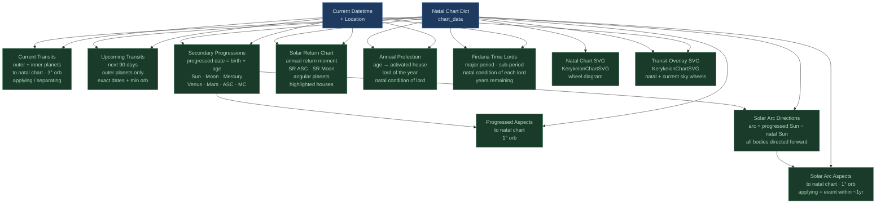

---

## Natal Chart Computation — Part 3: Vedic Overlay

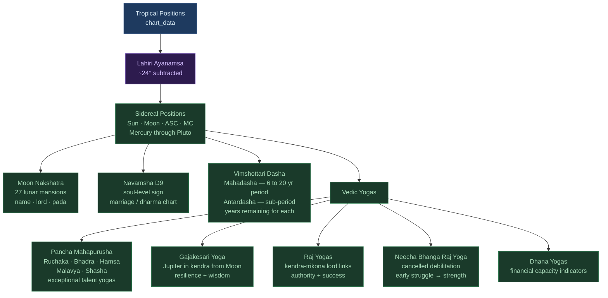

---

## Synastry Computation Pipeline

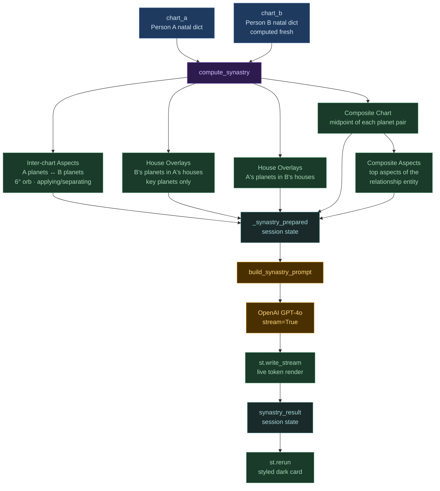

---

## LLM Prompt Architecture

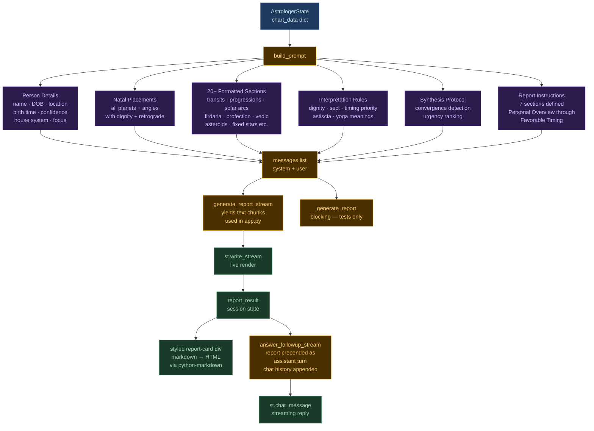

---

## Module Dependencies

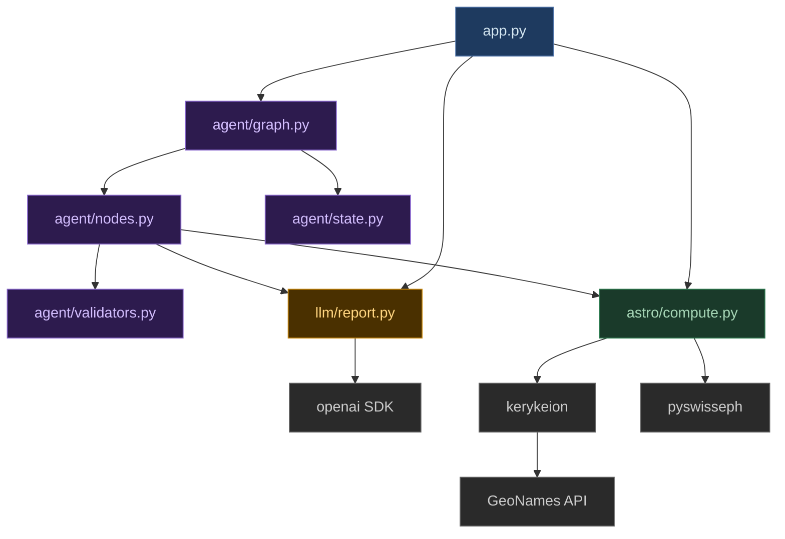

---

## Session State Lifecycle with Timings

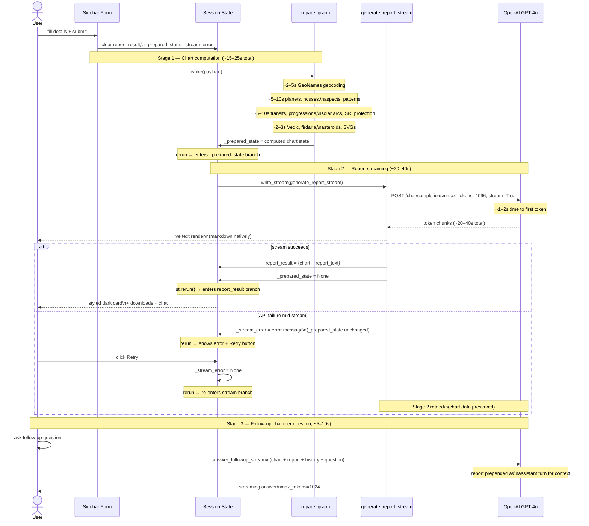
